# Zettelkasten Online

Mit der Anwendung *Zettelkasten Online* können Wissenschaftler und Studierende aus der ganzen Welt für Forschungsarbeiten ihre Quellen in Form von wissenschaftlicher Literatur zentral verwalten und auf eine übersichtliche Darstellung aller aufbereiteten Werke mit ihren zentralen Thesen und dazugehörigen Details zurückgreifen.

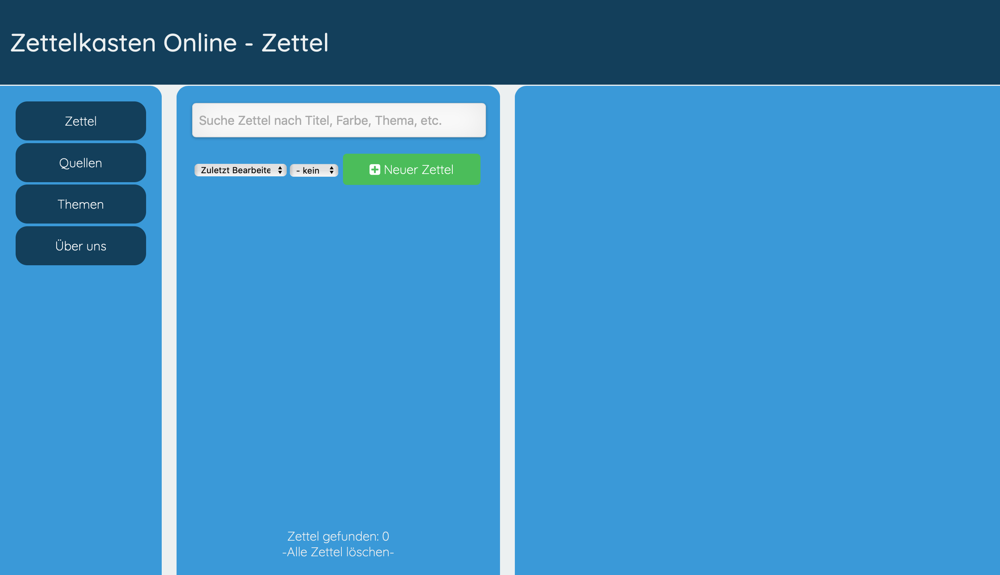

## Team

| | Infos | Implementierte Komponenten
|-|-|-|
 | **Viet Dung Le** E-Mail:  viet-dung.le@student.ur.de Github-Nutzer: dichrogfx | Viet Dung Le konzentrierte sich primär auf das Design der Anwendung und das Auftreten nach außen, sodass der Punkt "Über uns" der Anwendung seine Handschrift trägt. Den Großteil der Dokumentation übernahm er ebenfalls, sodass alles ersichtlich ist und die Hintergründe des Softwaresystems verständlich für Dritte sind. Außerdem prüfte er die optischen Aspekte der Anwendung und passte sie bei Bedarf an oder verschönert sie.
|-|-|-|
 | **Konstantin Kulik** E-Mail: konstantin.kulik@student.ur.de Github-Nutzer: kotjik | Konstantin Kulik übernahm den programmatischen Teil der Anwendung. Er implementierte alle abgesprochenen Funktionen und stellte sicher, dass diese bugfrei sind. Er gestaltete auch die Anwendung möglichst benutzerfreundlich, sodass der Nutzer beispielsweise seine erstellten Zettel nicht unabsichtlich löscht. Im Übrigen stellte er das  Skellet der Anwendung auf und bestimmte dadurch das generelle Layout. Bei der Gestaltung einzelner Komponenten hat er ebenfalls mitgewirkt.|

## Setup

So nehmen Sie die Anwendung in Betrieb:

1. Führen Sie **einmalig** den Befehl `npm install` aus, um die notwendigen Abhängigkeiten (`express`) zu installieren.

2. Führen Sie den Befehl `npm start` aus um die Anwendung zu starten. Der Inhalt des `/app`-Verzeichnis ist anschließend über die Adresse `http://localhost:8000/app` erreichbar.

Das ist der Link zu einer funktionierenden, im WWW-gehosteten Version der Anwendung (auf Groß- & Kleinschreibung achten): <a href="https://kotjik.github.io/Zettelkasten-Online/app/index.html">https://kotjik.github.io/Zettelkasten-Online/app/index.html</a>

## Beschreibung

Zettelkasten Online ist eine Webanwendung für Wissenschaftler und Studierende aus der ganzen Welt. Über ein einfaches Interface können die wichtigsten Informationen zu einem wissenschaftlichen Werk als "digitale Zettel" gespeichert werden. Nutzer können eine Liste aller eingegebenen Zettel einsehen, welche gefiltert, sortiert und gesucht werden können. Zusätzlich ist eine nachträgliche Bearbeitung und die unwiderrufliche Löschung von Zetteln möglich.

## Features

Eine Übersicht aller ursprünglich geplanten und dokumentierten Features finden Sie [hier](Features.md).

- Start und *Neuer Zettel*: Beim Start öffnet sich der Menüpunkt Zettel. Hier können Nutzer eine *Übersicht über ihre bisher erstellten Zettel in einer minimierten Ansicht* einsehen mit Details über den *Titel*, die *Quelle*, dem *Thema*, dem dieser Zettel untergeordnet ist, der zugeteilten *Farbe* und dem *Datum der letzten Bearbeitung*.
Über dieser Liste finden sich eine *Such-* sowie eine *Sortier-* und eine *Filterungsfunktion*.
Darunter ist hingegen die Anzeige der *Zettel-Anzahl* und die Option, *alle bisher erstellten Zettel zu löschen*.
Links findet man die Menü-Leiste mit den klickbaren Punkten *Zettel*, *Quellen*, *Themen* und *Über uns*, wobei Quellen und Themen sowie auch andere erwähnte Funktionalitäten im Verlauf dieser Beschreibung im Detail erklärt werden.
Klickt der Nutzer auf den grün hinterlegten Button *Neuer Zettel*, lässt sich in einer Texteditor-Ansicht auf der rechten Seite des Bildschirms ein neuer Zettel für seine Sammlung anlegen. Hierfür kann ein *Titel* mit einer *Beschreibung*, der *Quelle*, dem zugehörigen *Thema* und einer selbstgewählten *Farbe* aus der vordefinierten Farbauswahl ausgewählt bzw. eingegeben werden. Für die Beschreibung sind eine Vielzahl üblicher Formatierungsarten von gängigen Texteditoren wie beispielsweise das Einbauen von Listenpunkten oder farbliche Hinterlegungen möglich.
Sind alle Details eingegeben, kann der angelegte Zettel gespeichert und zur Bestandsliste hinzugefügt oder der gesamte Prozess abgebrochen werden.

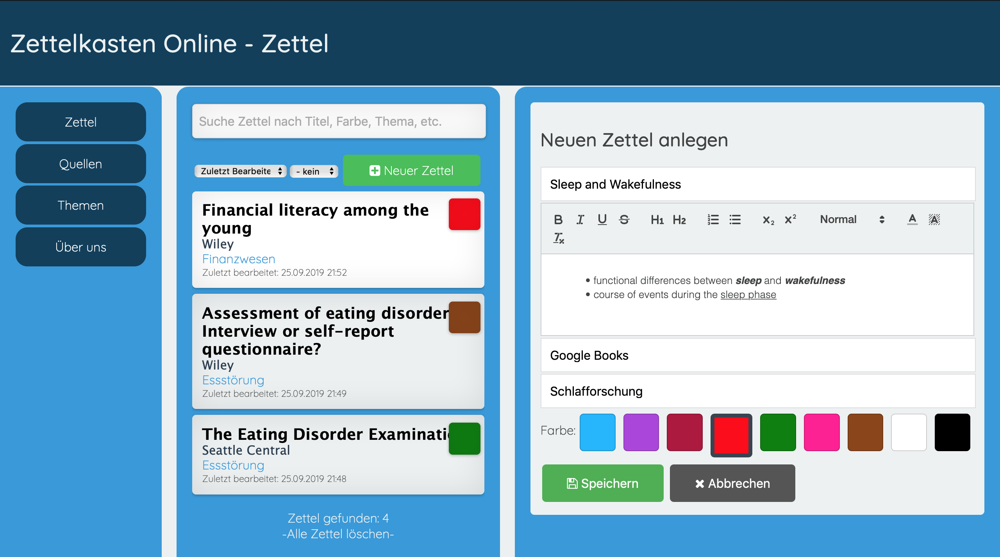

- *Detailansicht* des Zettels: Durch das Klicken auf ein Listenelement der Zettel, können die Benutzer eine *detaillierte Ansicht* eines angelegten Zettels betrachten, die im Gegensatz zur minimierten Anzeige zusätzlich noch ein Kästchen mit der *Beschreibung*, das *Erstellungsdatum* und ein Button zum *Bearbeiten* enthält. Außerdem stellen die Felder des *Themas*, der *Quelle* und der *Farbe* klickbare *Verlinkungen* zu einer Auflistung von Zetteln dar, die zum aktuell angezeigten Zettel Überschneidungen des gewählten Attributs aufweisen.

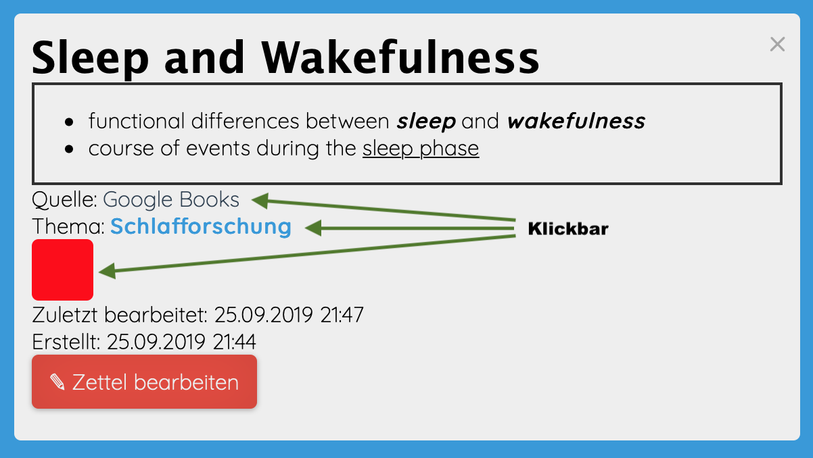

- Zettel *bearbeiten*: Das Interface zum *Bearbeiten* ist optisch fast identisch zu dem, wenn ein Zettel neu angelegt wird. So können Nutzer zuvor eingetragene *Eigenschaften des Zettels ändern*. Hier hat er aber zusätzlich noch die Option den gesamten Zettel mit all seinen Informationen *unwiderruflich zu löschen*.

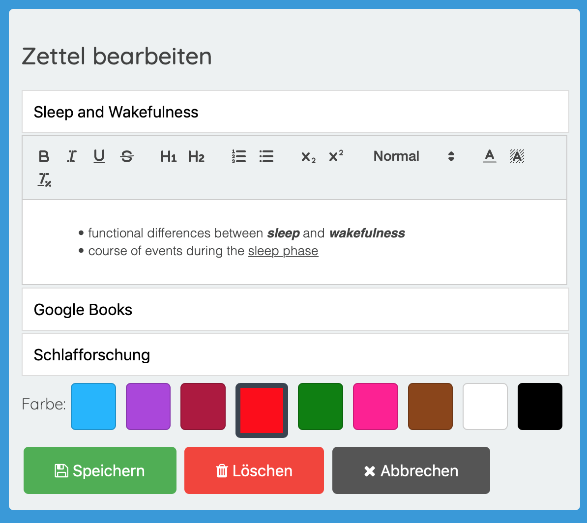

- *Löschen eines Zettels*: Wählt der Nutzer beim Bearbeiten die Option den Zettel zu *löschen* muss er dies nochmals bestätigen, um ihn aus der Datenbank unwiderruflich zu entfernen.

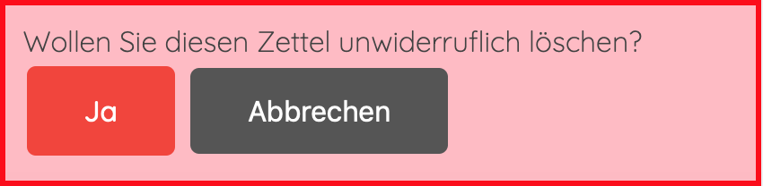

- *Löschen aller Zettel*: Die zu Beginn erwähnte Option, *alle jemals angelegten* Zettel zu löschen, kann der Nutzer dazu nutzen, seine Zettel-Liste unwiderruflich zu löschen. Hierfür muss in einem Text-Eingabefeld zusätzlich noch „DELETE“ ohne Abweichungen eingegeben werden, um die Aktion zu bestätigen.

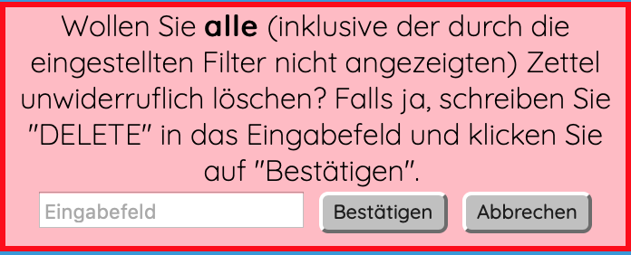

- *Suchfunktion*: Die *Stichwortsuche* ermöglicht es dem Nutzer Zettel mit Eingaben in Form von Strings zu suchen, die in einem der Details der Zettel zu finden sind. Alle für die Anfrage nicht relevanten Zettel werden infolgedessen ausgeblendet. Die Suchkriterien passen sich der aktuellen Menüpunktes an. Befindet man sich beispielsweise auf der Quellen-Ansicht, wird dementsprechend nur nach Übereinstimmung in der Quelleangaben mit dem eingegebenen Wort gesucht.

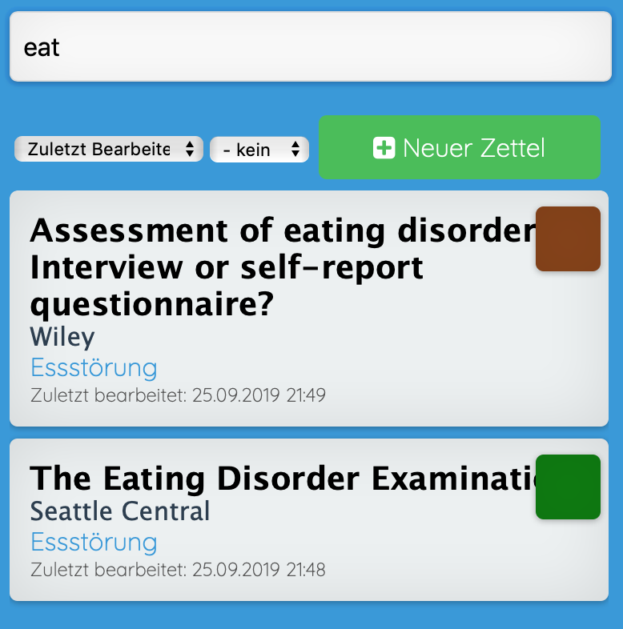

- *Filterfunktion*: Der Nutzer kann mithilfe eines Drop-Down-Menüs durch die Auswahl einer Farbe nach eingestellten *Farben filtern*. Die nicht relevanten Zettel werden dementsprechend ausgeblendet.

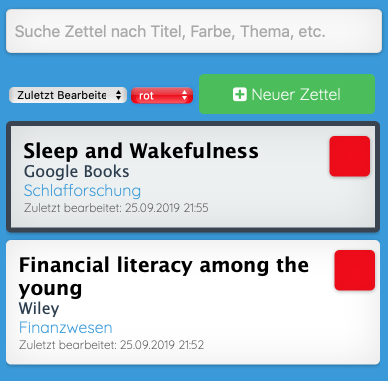

- *Sortierfunktion*: Der Nutzer kann mithilfe eines Drop-Down-Menüs die *Reihenfolge* der Zettel innerhalb der Liste nach den Kriterien der *letzten Bearbeitung*, des *Erstellungsdatum* und der *alphabetischen Anordnung* auf- sowie absteigend sortieren.

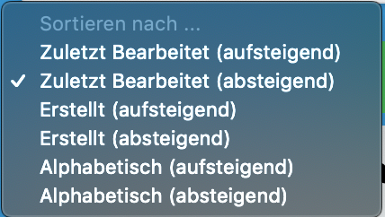

- *Quellen-* und *Themen-Übersicht*: Der Nutzer kann durch die Auswahl des Menüpunktes *Quellen* sich eine Auflistung aller Quellen anzeigen lassen, bei der neben dem *Titel* auch die *Anzahl* der Zettel mit dieser Quelle angezeigt wird. Klickt man auf eine der Quellen erhält man auf der rechten Seite eine Aufzählung über alle Zettel der entsprechenden Quelle.
Äquivalent ist der Menüpunkt der *Themen*.

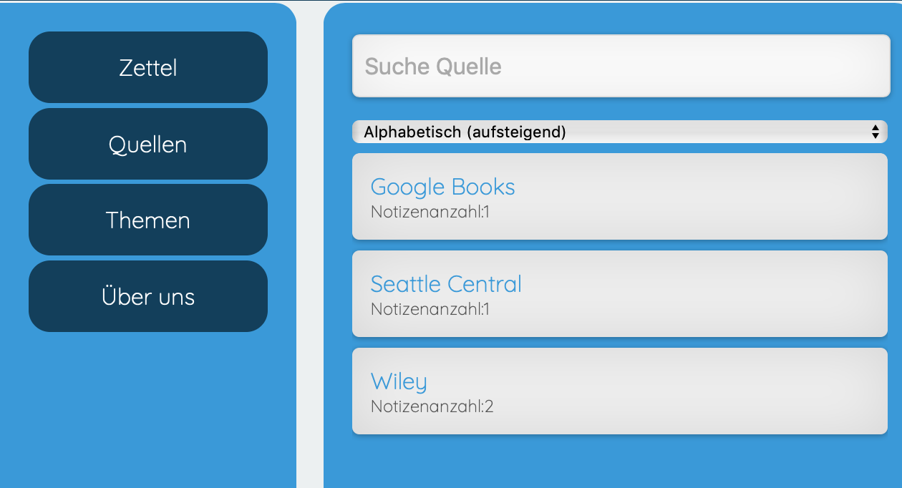
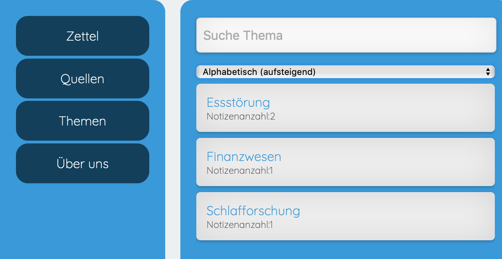
  

